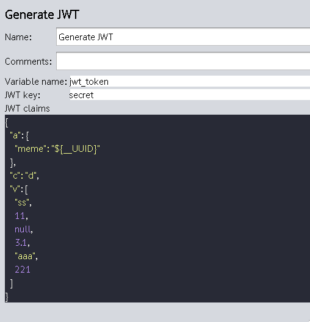

# Jmeter plugins

This repository is used to store my Jmeter plugins. 

All plugins are distributed as single Uber-Jar file.
If you install it you'll get all plugins within one file.

## JWTEncoder

This plugin is used to create [JSON Web Tokens](https://jwt.io/introduction) and store them
as a variable in Jmeter's context.

Currently it can encode only using HS256 algorithm. More algoritms will be 
added in the future if needed.

It generates JWT based on claims you provide and the secret key.
You can specify a variable name that will be used to 
store resulting jwt in jmeter's context.

Also you can use jmeter's variables in claims. As an exmaple in the screenshot above `"${__UUID}"` is used as a part of claims.